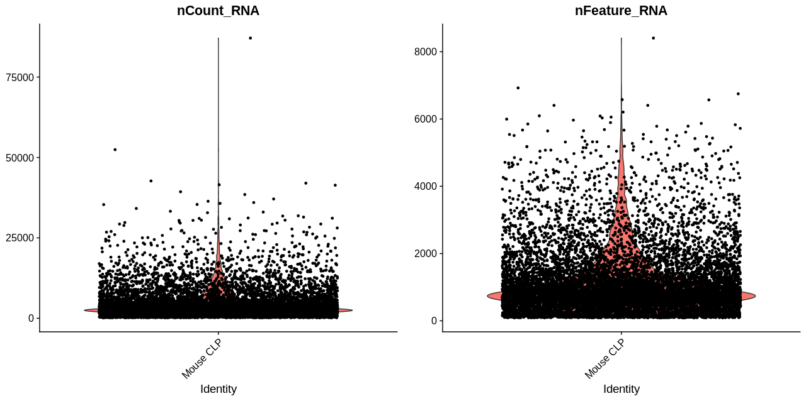
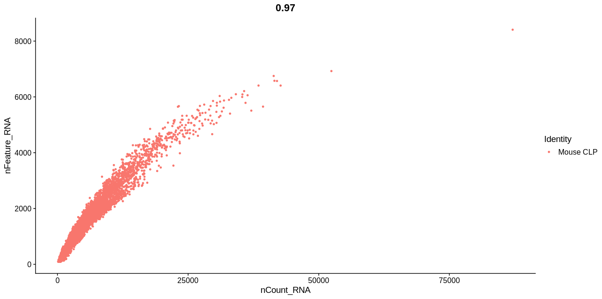
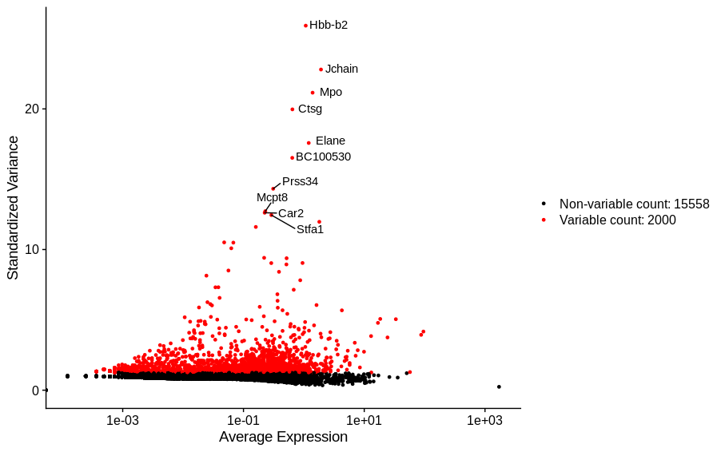
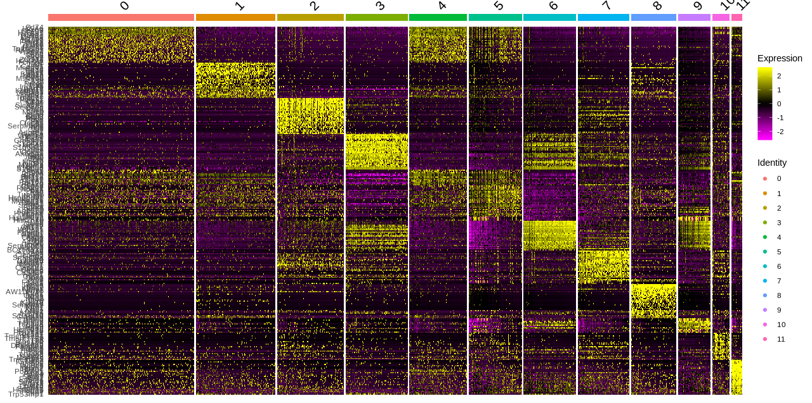
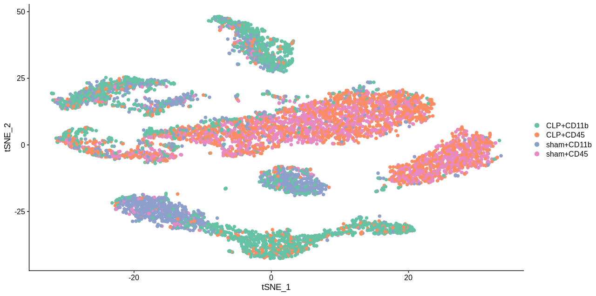
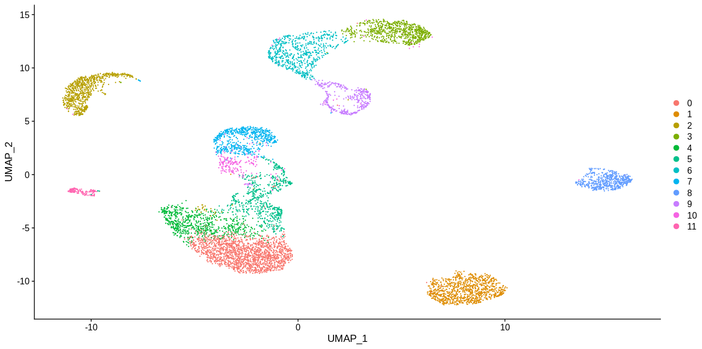

# 基于Seurat3.0的单细胞分析流程

Version 1.0  
Mar 19, 2020
  
## 设置数据文件夹和文件路径

```R
# 包含单细胞数据和细胞信息的文件夹名称
setwd(dirname(rstudioapi::getActiveDocumentContext()$path))
setwd("../")
scRNA.dir <- getwd()
# 单细胞数据文件名
scRNA.table.fname <- file.path(scRNA.dir, "12_Whole_20171107_CLP_MOUSE.dge.txt")
# 细胞信息文件名
primer.design <- "2017_1107_CLP_primer_design.xlsx"
```

## 函数设置

```R
# 该函数本来存在于Seurat2中， Seurat3将其删掉，由于方便V2到V3的转换，在此将该函数重新定义
ExtractField <- function(string, field = 1, delim = "_") {
  fields <- as.numeric(x = unlist(x = strsplit(x = as.character(x = field), split = ",")))
  if (length(x = fields) == 1) {
    return(strsplit(x = string, split = delim)[[1]][field])
  }
  return(paste(strsplit(x = string, split = delim)[[1]][fields], collapse = delim))
}
```

## 加载R包

```R
library(Seurat)
library(dplyr)
library(openxlsx)
library(Matrix)
library(data.table)
library(RColorBrewer)
library(Biobase)
```

## 参数设置

```R
random.seed <- 123
set.seed(random.seed)
project.name <- "Mouse CLP"
epsilon <- 1e-05  
expression.thresh <- 1  

max.umi <- 10000  # for downsampling normalization
do.downsampling <- FALSE  # for downsampling

min.cells <- 3  # for filtering genes

min.features <- 90  # for filtering cells
nCount_RNA.low <- min.features  # for filtering cells
filter.low.exp.cells <- TRUE
nFeature_RNA.low <- 500  # for filtering cells

pcs.compute <- 30  # for PCA
pcs.use <- 1:10
dims.use <- pcs.use
vars.to.regress <- c("nUMI")  # for suppressing batch effect
regress.model <- "linear"  # for suppressing batch effect, linear, poisson, negbinom

vg.mean.cutoff <- c(0.45, 3)
vg.dispersion.cutoff <- c(0.15, Inf)
```

## 函数定义

```R
ExtractField <- function(string, field = 1, delim = "_") {
  fields <- as.numeric(x = unlist(x = strsplit(x = as.character(x = field), split = ",")))
  if (length(x = fields) == 1) {
    return(strsplit(x = string, split = delim)[[1]][field])
  }
  return(paste(strsplit(x = string, split = delim)[[1]][fields], collapse = delim))
}
```

## 创建Seurat对象

```R
# 读单细胞文件
scRNA.table <- fread(scRNA.table.fname, header = TRUE, data.table = F)
rownames(scRNA.table) <- scRNA.table$GENE
scRNA.table <- scRNA.table[, - which(colnames(scRNA.table) == "GENE")]
# 将细胞名以"_"分割
colnames(scRNA.table) <- sapply(colnames(scRNA.table), function(x)(paste(substr(x,1,8), substr(x,9,12), substr(x,13,18), sep="_")))
# 加载primer信息
primer.meta <- read.xlsx(file.path(scRNA.dir, primer.design))
rownames(primer.meta) <- paste(primer.meta$index, primer.meta$ligase, sep = "_")
# 将原始信息以另一变量储存，这样就不需要再重新读文档，方便进行参数调试。在生产环境中可以省略此步骤以节约空间
scRNA.data <- scRNA.table
scRNA.data[is.na(scRNA.data)] <- 0
scRNA.data <- Matrix(as.matrix(scRNA.data), sparse = T)
# 进行细胞下采样
if (do.downsampling) {
  scRNA.data.ds <- SampleUMI(scRNA.data, max.umi = max.umi)
  dimnames(scRNA.data.ds) <- dimnames(scRNA.data)
} else {
  scRNA.data.ds <- scRNA.data
}
#create a Seurat object
scRNA <- CreateSeuratObject(counts = scRNA.data.ds, project = project.name, names.field = 1:2, names.delim = '_', min.cells = min.cells, min.features = min.features)
```

## 数据预处理

### 1. 过滤离群细胞

该步骤就是根据基因的表达量特征，对细胞进行过滤。通过人为指定阈值，过滤掉一部分离群细胞后，再进入到下游分析。  
为了指定合适的阈值，需要用到单细胞数据中的几个指标，常用的有以下两个。
>
>1. nCount_RNA
>2. nFeature_RNA
>
`nCount_RNA`代表的是一个细胞中检测到表达量大于0的基因的个数，`nFeature_RNA`代表的是一个细胞中基因表达量的总和。  
通过小提琴图来展示对应的分布，步骤如下：

```R
#add additional metadata
scRNA@meta.data[, "batch"] <- unlist(lapply(colnames(scRNA), ExtractField, 1:2))
scRNA@meta.data[, "class"] <- primer.meta[unlist(lapply(colnames(scRNA), ExtractField, 1:2)), "type"] %>% as.factor
scRNA@meta.data[, "marker"] <- sapply(as.character(scRNA@meta.data$class), ExtractField, 2, "\\+") %>% as.factor
scRNA@meta.data[, "op"] <- sapply(as.character(scRNA@meta.data$class), ExtractField, 1, "\\+") %>% as.factor
# 过滤掉"class"指标为空的细胞
scRNA <- subset(x = scRNA, subset = class != "NA")

# 绘制小提琴图
VlnPlot(object = scRNA, features = c("nCount_RNA", "nFeature_RNA"))
```



图中每个点代表一个细胞，反映对应的指标在所有细胞中的分布情况。

接下来考虑这两个指标之间的相互关系可以通过函数`FeatureScatter`得到。

```R
FeatureScatter(object = scRNA, feature1 = "nCount_RNA", feature2 = "nFeature_RNA")
```



根据图中所表现出来的相关性，可以更好地设置需要过滤的阈值，之后使用`subset`函数进行过滤。

```R
scRNA <- subset(scRNA, subset = nCount_RNA > nCount_RNA.low & nFeature_RNA > nFeature_RNA.low)
```

### 2. 标准化数据(Normalization)

```R
scRNA <- NormalizeData(scRNA)
```

### 3. 识别高度可变特征(Find Highly Variable Features)

计算在数据集中表现出高细胞间差异的特征子集，在下游分析中关注这些特征有助于突出单细胞数据集中的生物信号。该过程在`FindVariableFeatures`中实现。

```R
scRNA <- FindVariableFeatures(scRNA, mean.function = ExpMean, dispersion.function = LogVMR, mean.cutoff = vg.mean.cutoff, dispersion.cutoff = vg.dispersion.cutoff)
# Mark the HVG
topvg10 <- head(VariableFeatures(scRNA), 10)
plotvg1 <- VariableFeaturePlot(scRNA)
plotvg2 <- LabelPoints(plot = plotvg1, points = topvg10, repel = TRUE)
plotvg2
```



### 4. 缩放数据(Scale Data)

使用`ScaleData`函数进行先行缩放，该步骤：
改变每个基因的表达，使得跨细胞的平均表达为0
缩放每个基因的表达，以便跨细胞的方差为1

```R
all.genes <- rownames(scRNA)
scRNA <- ScaleData(scRNA, features = all.genes, vars.to.regress = c("nFeature_RNA"), model.use = "linear")
```

该步骤在下游分析中给予相同的权重，因此高表达的基因不占优势。

结果存储在 `pbmc[["RNA"]]@scale.data`

## 线性降维聚类(PCA)

该步骤采用两次PCA降维。

第一次使用`runPCA`默认参数进行降维，再使用`JackStraw`函数进行重采样测试，通过`ProjectDim`函数将预先计算的将为结果投影到整个数据集上。

第二次降维首先用`PCASigGenes`获取基于`JackStraw`分析得到的在统计学上与主成分相关联的一组基因，接着基于这些基因再次使用`runPCA`进行降维。

```R
#PCA analyze
scRNA <-RunPCA(scRNA)
scRNA <- JackStraw(scRNA)
scRNA <- ProjectDim(scRNA)

gene.use <- PCASigGenes(scRNA, pcs.use = pcs.use, pval.cut = 1e-10)
scRNA <- RunPCA(scRNA, features = gene.use, npcs = pcs.compute)

PCAPlot(scRNA)
```

## 细胞聚类

可以采用`Seurat`包内置的聚类方法，也可以使用`cytofkit`包进行聚类。*后者由于版本更新等原因，尚未通过测试。*

函数`FindClusters`应用模块化技术将细胞迭代分组在一起，函数的分辨率参数`resolusion`用于设置下游集群的“粒度”。对于大约3K单元格的单细胞数据集来说，参数设置在0.4-1.2之间通常会返回较好结果。较大的数据集通常会增加这一分辨率。可以使用`Idents`函数找到该群集。

```R
dims.use <- pcs.use
#cytofkit测试未通过，此处传入FALSE
use.phenograph <- FALSE
if (use.phenograph) {
  
  library(cytofkit2)
  
  # 细胞的PC坐标
  cells.pcs <- GetCellEmbeddings(scRNA, reduction.type = "pca", dims.use = dims.use)
  
  # 调用Phenograph聚类
  phenograph.res <- Rphenograph(cells.pcs, k = 30)
  
  phenograph.ident <- NULL
  for (i in 1:length(phenograph.res)) {
    l <- phenograph.res[[i]]
    ident <- rep(i, length(l))
    names(ident) <- rownames(cells.pcs)[as.numeric(l)]
    phenograph.ident <- c(phenograph.ident, ident)
  }
  scRNA@ident <- factor(phenograph.ident[scRNA@cell.names])
} else {
  
  # 使用Seurat聚类
  scRNA <- FindNeighbors(scRNA, dims = dims.use)
  scRNA <- FindClusters(scRNA, random.seed = random.seed, resolution = 0.5)
}
```

## 生成表达热图

```R
# find markers and do heat map
scRNA.markers <- FindAllMarkers(object = scRNA, only.pos = TRUE, min.pct = 0.25,thresh.use = 0.25)
topMarkers <- scRNA.markers %>% group_by(cluster) %>% top_n(30, avg_logFC)
DoHeatmap(object = scRNA, features = topMarkers$gene, label = TRUE)
```



## 运行非线性降维(tSNE, UMAP)

```R
#tSNE分析
scRNA <- RunTSNE(object = scRNA, reduction.use = "pca", dims.use = dims.use,do.fast = FALSE, perplexity = 96, max_iter = 1000)

tsne.colors <- colorRampPalette(brewer.pal(nlevels(scRNA@meta.data$class), "Set2"))(nlevels(scRNA@meta.data$class))
# note that you can set do.label=T to help label individual clusters
TSNEPlot(object = scRNA, group.by = "class", pt.size = 2, label = FALSE,cols = tsne.colors, title = "sham + CLP")

# Sham细胞 CD11b
TSNEPlot(object = scRNA, group.by = "marker", pt.size = 2,cells = colnames(scRNA)[grep("sham\\+cd11b", scRNA@meta.data$class,ignore.case = TRUE)], cols = tsne.colors[grep("sham\\+cd11b",levels(scRNA@meta.data$class), ignore.case = TRUE)], title = "sham")
# Sham细胞 CD45
TSNEPlot(object = scRNA, group.by = "marker", pt.size = 2,cells = colnames(scRNA)[grep("sham\\+cd45", scRNA@meta.data$class,ignore.case = TRUE)], cols = tsne.colors[grep("sham\\+cd45",levels(scRNA@meta.data$class), ignore.case = TRUE)], plot.title = "sham")
# CLP cd11b
TSNEPlot(object = scRNA, group.by = "marker", pt.size = 2,cells = colnames(scRNA)[grep("clp\\+cd11b", scRNA@meta.data$class,ignore.case = TRUE)], cols = tsne.colors[grep("clp\\+cd11b", levels(scRNA@meta.data$class),ignore.case = TRUE)], plot.title = "CLP")
# cd45
TSNEPlot(object = scRNA, group.by = "marker", pt.size = 2,cells = colnames(scRNA)[grep("clp\\+cd45", scRNA@meta.data$class, ignore.case = TRUE)],cols = tsne.colors[grep("clp\\+cd45", levels(scRNA@meta.data$class),ignore.case = TRUE)], plot.title = "CLP")
```



```R
# UMAP分析
scRNA <- RunUMAP(scRNA, dims = 1:10)
DimPlot(scRNA, reduction = "umap")
```


